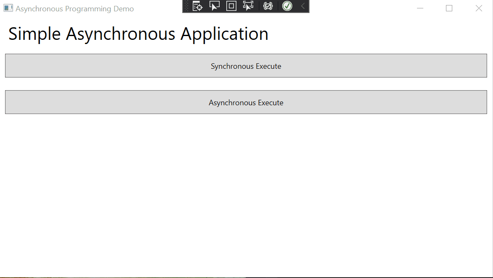

# What we will build

# What is `Synchronous`?
By default, any method we normally create in the C# applicication is synchronous by default.
* Synchronous represents a set of the activities that starts happening in sequences.
* A synchronous call waits for the method to be completed before continuing with the program flow.
## Synchronous programming problem
The problem with the synchronous application is that no one else can do anything until the previous task get completes.
## How does synchronous cause trouble?
1. It badly affects the user interface (UI) that has just one thread to run its entire user interface code. It blocks UI whenever the user attempts to perform some code lengthy (time-consuming) operation
2. It causes performance on the application if there are multiple operations that do not rely on the other operation. For example, if you have 3 operations called A, B, C; and they are not depending on each other. In the synchronous environment, operation B will have to wait for A to be completed before it can be executed, and the same for C to wait for B. Therefore, it causes the performance impact on the application.
# What is `Asynchronous`?
Asynchronous programming is to fix the problem of synchronous programming, it is allowing multiple tasks to run parallel.
An asynchronous method call (a thread will be created) will return immediately so that the application can continue to perform the rest of the operations while the called method completes its works in its conditions.
## Asynchronous program usages
1. The UI-intensive application in which the user experience is the primary concern. An asynchronous application allows the user interface to remain responsive to the user.
2. The application has a complex and expensive computational task, the user can continue interacting with the UI while waiting for the result from the long-running task.
# Async and await asynchronous
The two new keywords, async and await, were introduced in C# 5.0 and .NET 4.5. There are implemented at the compiler level and build on top of the `System.Threading.Tasks.Task` feature of .NET 4.0. Async/Await offers a completely different and easy way to do asynchronous programming.
## Async
The keyword is used to tell a function as an asynchronous.
```csharp
public async Task ExecuteLongTask() {
    // Your task
}
```
Here the Executetask() method is declared as an asynchronous method. Now, it is ready to be called asynchronous.
<span style="color:red">It is very important here, do not return void from an asynchronous method, if there is nothing to return, we just put the return type</span> `Task`. If you have something to return, for example, return the `string` value
```csharp
public async Task<string> ExecuteLongTask() {
    // Your task
}
```
However, if the method is an event, then the async event can returns `void`
## Await
This keyword is used when we call it an asynchronous method. For example, we have a long process to be called
```csharp
public async Task ExecuteLongTask() {
    await Task.Run();
    ///
    /// Handle result
    ///
}
```
# Code Explanation
In the example [async_programming_demo](https://github.com/thangdc1982/async_programming_demo), the application has two buttons `Synchronous Execute` and `Asynchronous Execute`. The button has the event click corresponding to its name, and the events are performing the task as their names.
## What does the application do?
The application simply go to the list of the websites and download each website and put the content to the string.
* If you click on the `Synchronous Execute`, you will notice the application will run and the UI will freeze until the task has completed and the result will write to the window at once. And this is how the code looks like.
```csharp
private void executeSync_Click(object sender, RoutedEventArgs e)
{
    var watch = System.Diagnostics.Stopwatch.StartNew();
    RunDownloadSync();
    watch.Stop();
    long elapseMs = watch.ElapsedMilliseconds;
    results.Text += $"Total execution time: {elapseMs}";
}

/// <summary>
/// Run download synchronous
/// </summary>
private void RunDownloadSync()
{
    results.Text = "";
    WebClient client = new WebClient();
    List<string> websites = WebsiteList();
    foreach (string url in websites)
    {
        string response = client.DownloadString(url);
        results.Text += String.Format("Download from {0}: total {1} characters\r", url, response.Length);
    }                        
}
```
* If you click on the button `Asynchronous Execute`, your UI does not freeze, you can move the window around while the code runs, and you will notice the output display one at a time. 
```csharp
private async void executeASync_Click(object sender, RoutedEventArgs e)
{
    var watch = System.Diagnostics.Stopwatch.StartNew();
    await RunDownloadASync();
    watch.Stop();
    long elapseMs = watch.ElapsedMilliseconds;
    results.Text += $"Total execution time: {elapseMs}";
}

/// <summary>
/// Run download asynchronous
/// </summary>
private async Task RunDownloadASync()
{
    results.Text = "";
    WebClient client = new WebClient();
    List<string> websites = WebsiteList();
    foreach (string url in websites)
    {
        string response = await Task.Run(() => client.DownloadString(url));
        results.Text += String.Format("Download from {0}: total {1} characters\r", url, response.Length);
    }
}
```
<span style="color:red">NOTE: In this implementation, we only solve the first issue of the synchronous application. And it is the UI interaction. But it does not help to improve any performance for the application</span>
# Improve the code to speed up the application
```csharp
private async void executeASync_Click(object sender, RoutedEventArgs e)
{
    var watch = System.Diagnostics.Stopwatch.StartNew();
    await RunDownloadParallelASync();
    watch.Stop();
    long elapseMs = watch.ElapsedMilliseconds;
    results.Text += $"Total execution time: {elapseMs}";
}

/// <summary>
/// Run download asynchronous
/// </summary>
private async Task RunDownloadParallelASync()
{
    results.Text = "";
    // List of the task
    List<Task<string>> tasks = new List<Task<string>>();
    
    List<string> websites = WebsiteList();
    foreach (string url in websites)
    {
        tasks.Add(Task.Run(() => {
            WebClient client = new WebClient();
            return String.Format("Download from {0}: total {1} characters\r", url, client.DownloadString(url).Length);                    
        }));                
    }
    // Wait for all the tasks are done
    string[] responses = await Task.WhenAll(tasks);
    foreach(string response in responses)
    {
        results.Text += response;
    }            
}
```
In the previous implementation, we are waiting for each download to finish and perform the next download. Therefore, it only solves the UI interaction issue. In the `RunDownloadParallelASync` we are implementing all the tasks that will run in parallel, so we only wait for the longest task to be completed before the data can be displayed.
```csharp
foreach (string url in websites)
{
    tasks.Add(Task.Run(() => {
        WebClient client = new WebClient();
        return String.Format("Download from {0}: total {1} characters\r", url, client.DownloadString(url).Length);                    
    }));                
}
```
creates each task and places them in tasks collection.
```csharp
// Wait for all the tasks are done
string[] responses = await Task.WhenAll(tasks);
```
is waiting for all the tasks in the collection to be completed.
So, the difference here is `RunDownloadASync` telling the application to do the download in sequence and wait for it to complete. `RunDownloadParallelASync` tells the application do the download in parallel for all the websites. 

# Conclusion
We have successfully implemented the asynchronous application using Async/Await syntax.